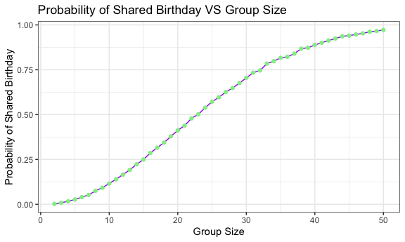
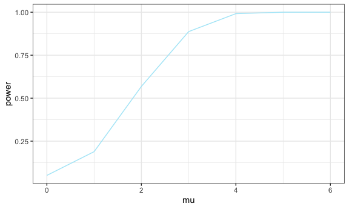

p8105_hw5_ryw2109
================
Rita Wang
2024-11-15

Given a function that computes the probability that at least two people
share a birthday for a fixed group size between 2 and 50, after running
10,000 times, the probability of shared birthdays as the group size
increase is shown above.

    ## geom_point: na.rm = FALSE
    ## stat_identity: na.rm = FALSE
    ## position_identity

    ## $x
    ## [1] "True Mean (mu)"
    ## 
    ## $y
    ## [1] "Power (Proportion Rejected)"
    ## 
    ## $title
    ## [1] "Power of the Test vs. True Mean (mu)"
    ## 
    ## attr(,"class")
    ## [1] "labels"

The power increases for effect sizes 0 to 4, however, for effect sizes 4
to 6, the power stayed relatively similar. The increase of power was
greatest for effect size 1 to 3. With the increase in effect size, there
is an increase of power, which in turn indicates higher probability of
rejecting the null hypothesis.

The sample average 𝜇 across tests for which the null is rejected is not
approximately equal to the true value of 𝜇. This may be due to sample
variability and Type I error.
