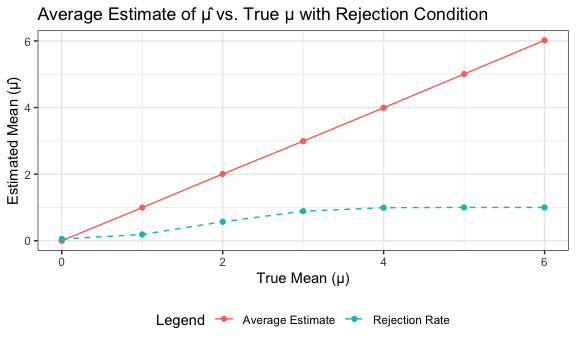

p8105_hw5_ryw2109
================
Rita Wang
2024-11-15

Given a function that computes the probability that at least two people
share a birthday for a fixed group size between 2 and 50, after running
10,000 times, the probability of shared birthdays as the group size
increase is shown above.

    ## geom_point: na.rm = FALSE
    ## stat_identity: na.rm = FALSE
    ## position_identity

    ## $x
    ## [1] "True Mean (mu)"
    ## 
    ## $y
    ## [1] "Power (Proportion Rejected)"
    ## 
    ## $title
    ## [1] "Power of the Test vs. True Mean (mu)"
    ## 
    ## attr(,"class")
    ## [1] "labels"

The power increases for effect sizes 0 to 4, however, for effect sizes 4
to 6, the power stayed relatively similar. The increase of power was
greatest for effect size 1 to 3. With the increase in effect size, there
is an increase of power, which in turn indicates higher probability of
rejecting the null hypothesis.

The sample average 𝜇 across tests for which the null is rejected is not
approximately equal to the true value of 𝜇. This may be due to sample
variability and Type I error.

The data provided has a total of 52179 rows and 12 columns. The dataset
consists of the following data information:

uid, reported_date, victim_last, victim_first, victim_race, victim_age,
victim_sex, city, state, lat, lon, disposition

    ## # A tibble: 51 × 4
    ##    city_state      estimate conf.low conf.high
    ##    <chr>              <dbl>    <dbl>     <dbl>
    ##  1 Albuquerque, NM    0.386    0.337     0.438
    ##  2 Atlanta, GA        0.383    0.353     0.415
    ##  3 Baltimore, MD      0.646    0.628     0.663
    ##  4 Baton Rouge, LA    0.462    0.414     0.511
    ##  5 Birmingham, AL     0.434    0.399     0.469
    ##  6 Boston, MA         0.505    0.465     0.545
    ##  7 Buffalo, NY        0.612    0.569     0.654
    ##  8 Charlotte, NC      0.300    0.266     0.336
    ##  9 Chicago, IL        0.736    0.724     0.747
    ## 10 Cincinnati, OH     0.445    0.408     0.483
    ## # ℹ 41 more rows

